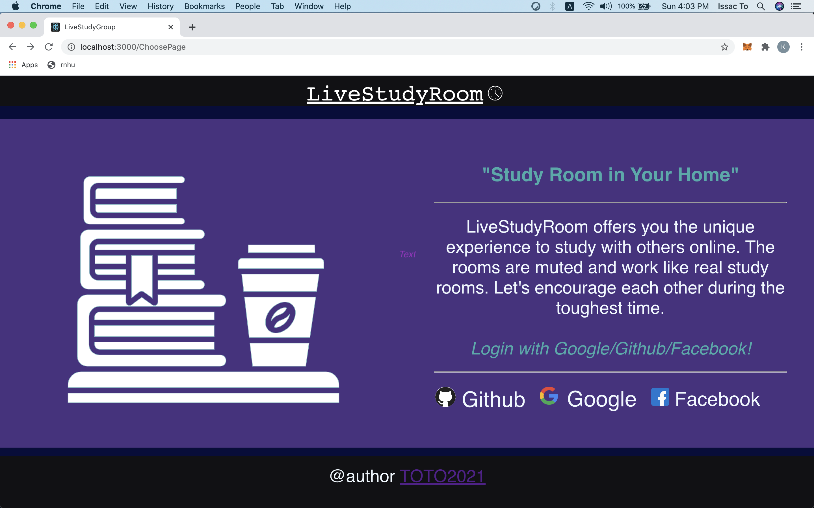
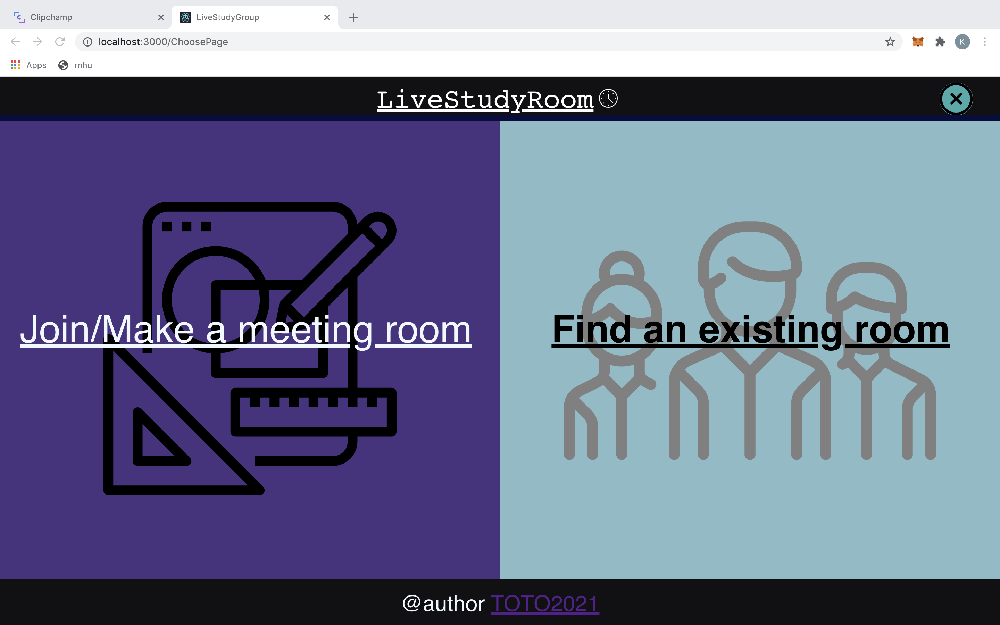
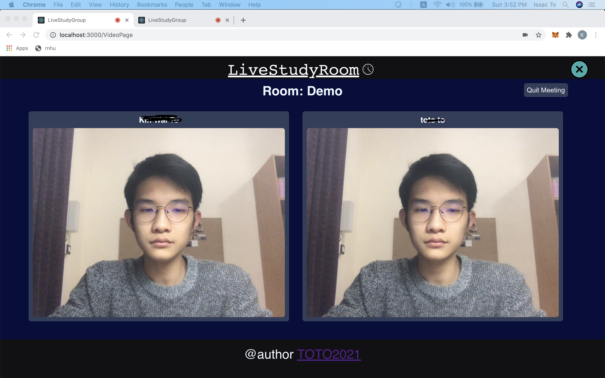
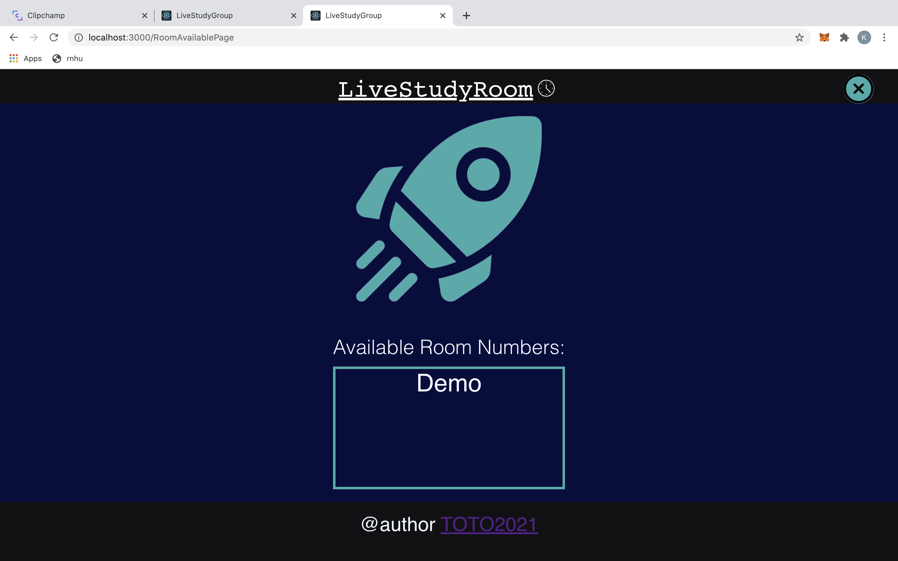

# LiveStudyRoom
<br/>About: Study Room in Your Home
<br/>Author: Issac To
<hr/>

| Landing         | Main           | 
| ------------- |:-------------:| 
|    |  |
| RoomInfo         | RoomIn         | 
|  |     |

## 1. 🎉 Inspiration/What it does

Are you a big fan of study group? I am sure a lot of you would miss revising efficiently at the study room. Forunately,LiveStudyRoom offers you the experience to study with people across the world together in a video meeting room with cameras opened. It is muted and works just like a study room where you would be pressurized by the environment and become disciplined. You could make a meeting room yourself or you could join others study room. All rooms at LiveStudyRoom are publicly open!


## 2. 📌 Structure

### A. 💎 Framework
* React
* Google Firebase (Oauth Github/Facebook/Google + Cloud Firestore)
* Express
* Node

### B. 🚀 Video Streaming Plugin
* Twillio

## 2.  📝 Implementation

1. Fill in your Google Firebase database uris inside the src/Components/Firebase/firebase.js file
``` javascript
const firebaseConfig = {
    apiKey: Yours,
    authDomain: Yours,
    projectId:Yours,
    databaseURL: Yours,
    storageBucket: Yours,
    messagingSenderId:Yours,
    appId: Yours,
    measurementId: Yours,
  };
```
2. Fill in your Twilio credentials inside the .env file

``` javascript

TWILIO_ACCOUNT_SID= Yours
TWILIO_API_KEY= Yours
TWILIO_API_SECRET= Yours

```

3. Install and run the program
```javascript 
npm install
npm run dev  
```

4. Go to http://localhost:3000

5. Enjoy!

## 4.  ⚠️Things I learnt
1. Challenge
<br/>Faced severe redux problem in the start due to conflicts with history.push. Spent more than two hours on it.
2. Accomplishments
<br/>Built the whole project soly within 24 hours. That is already something extraordinary for me
3. What we (I) learned
<br/>Try to solve other parts first next time when i get stuck
4. What's next for LiveStudyRoom
<br/>Hopefully could become a open-source project/ deploy on heroku
## 5.  ↗️ Reference
<br/>1. https://www.twilio.com/blog/video-chat-react-hooks (Huge Shoutout!)